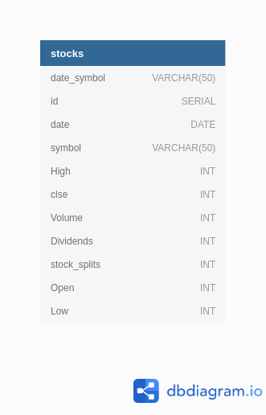

### Purpose

This is a POC showing how you can use Jenkins and MLflow with Machine Learning.

### Links

[MLflow](http://localhost:5000/)  
[Jenkins](http://localhost:8082/)   
[DBadmin](http://localhost:8080/)    

### Directions

1. adjust the docker-compose file to point to your bucket
2. sudo docker-compose up
3. login to jenkins 
    * use the password provided in the docker-compose output
    * install suggested plugins
    * use the jenkins file and create a pipeline


### Data

The data used is pulled from yahoo finance.    




### ML

The Machine Learning in this project is just used as an example. 
It is a clustering algorith called Gaussian mixture models implemented using sklearn.

* Model will be saved in S3
* The all data round the training of the models will be stored in PostgreSQL and visable via MLflow.


### setup jenkins container
```
sudo docker ps
sudo docker exec -it -u root <contianerid> bash

apt-get update && \
apt install -y python3-pip python3 && \
apt-get install -y make build-essential libssl-dev zlib1g-dev libbz2-dev \
  libreadline-dev libsqlite3-dev wget curl llvm libncurses5-dev libncursesw5-dev \
  xz-utils tk-dev libffi-dev liblzma-dev python-openssl git && \
  su - jenkins &&\
curl https://pyenv.run | bash && \
export PATH="$HOME/.pyenv/bin:$PATH" && \
eval "$(pyenv init -)" && \
eval "$(pyenv virtualenv-init -)"&& \
pyenv install 3.7.4 && \
pyenv virtualenv 3.7.4 app && \
pyenv activate app && \
pip3 install pandas yfinance psycopg2-binary pytest sklearn mlflow boto3 && \
pyenv deactivate 
```
### AWS

Currently credentials are shared by using a volume in docker. It will use the default profile.


